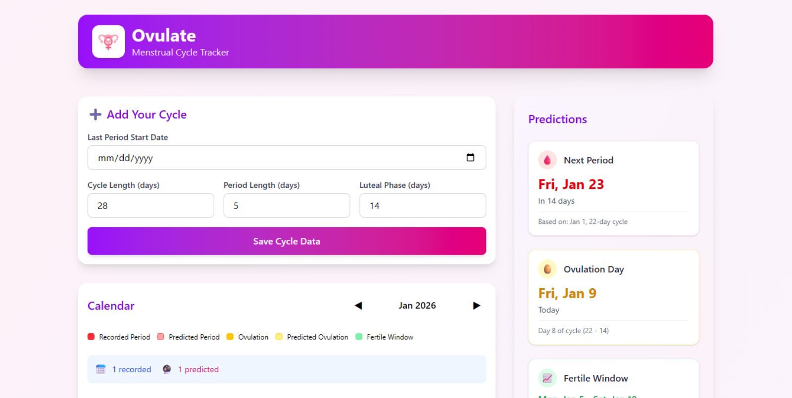
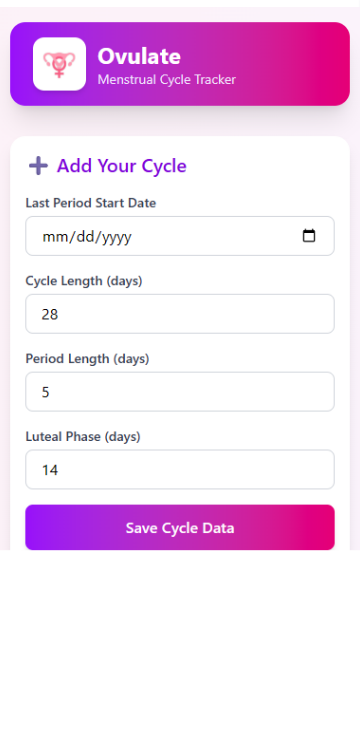

# Ovulate - Menstrual Cycle Tracker

Ovulate is a privacy-focused, offline-first menstrual cycle tracker built with React, Vite, and Tailwind CSS. It computes ovulation dates, fertile windows, active periods, and safe/unsafe sex phases for educational and family planning purposes.

## Features

- Added Tauri Support for as Desktop (windows) app, not just PWA.
- Cycle logging and average length tracking.
- Ovulation and fertile window predictions.
- Interactive calendar view with an educational safe and unsafe periods overlay.
- Visual day selection details card explaining the biology of sperm and egg longevity.
- High-performance, fully responsive layout optimized for mobile and desktop screens.
- Progressive Web App support for standalone offline installation.
- 100 percent private: all data is stored locally in the browser via localStorage.

## Screenshots

### Desktop UI


### Mobile UI


## Getting Started

### Prerequisites

Ensure you have Node.js and pnpm installed.

### Installation

1. Clone the repository:
   ```bash
   git clone https://github.com/carlodandan/ovulate.git
   cd ovulate
   ```

2. Install dependencies:
   ```bash
   pnpm install
   ```

3. Start the development server:
   ```bash
   pnpm run dev (for vite) / pnpm tauri dev (for tauri)
   ```

4. Build for production:
   ```bash
   pnpm run build (for vite) / pnpm tauri build (for tauri)
   ```

## Technology Stack

- Frontend Library: React 19
- Build Tool: Vite 7 / Tauri 2.0
- CSS Framework: Tailwind CSS 4
- Package Manager: pnpm

## License

This project is licensed under the MIT License.
