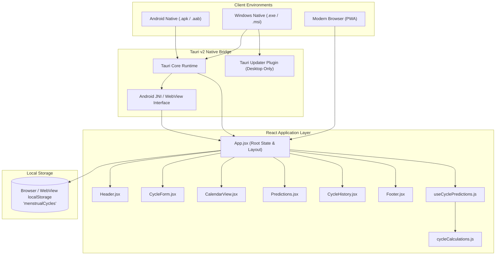
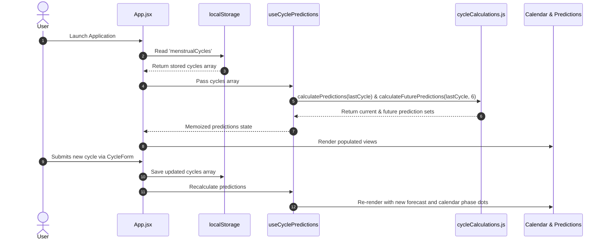

# System Architecture & Design

This document details the architectural design, component composition, data flow, responsive layout strategy, and cross-platform runtime environment of **Ovulate**.

---

## 1. High-Level System Architecture

Ovulate is structured as a client-side single-page application (SPA) wrapped in a **Tauri v2** native shell for desktop (Windows) and mobile (Android) distributions, while also capable of running as a progressive web application (PWA) in standard modern browsers.



---

## 2. Component Hierarchy & Information Flow

### Component Structure
```
App (manages `cycles`, `selectedDate`, `mobileTab`)
 │
 ├── Header (brand logo, total cycles counter, avg length chip, reset trigger)
 │
 ├── [Desktop Layout - 3 columns]
 │    ├── Left Column (span 2)
 │    │    ├── CycleForm (logging input for cycle start, lengths)
 │    │    ├── CalendarView (monthly grid, phase badges, safe overlays, date drilldown)
 │    │    └── CycleHistory (list of logged cycles, standard deviation stats, deletions)
 │    │
 │    └── Right Column (span 1 - Sticky)
 │         └── Predictions (countdown to next period, fertile window, safe phases)
 │
 ├── [Mobile Layout - Single View + Bottom Navigation]
 │    ├── Dynamic View (rendered according to `mobileTab`: 'calendar' | 'forecast' | 'log' | 'history')
 │    └── Bottom Navigation Bar (48dp touch targets, safe area inset padding)
 │
 └── Footer (medical disclaimer, zero-telemetry badge, privacy policy links)
```

### Data Flow Diagram



---

## 3. Responsive Strategy: Desktop vs. Mobile

Ovulate uses a dual-layout presentation pattern implemented cleanly in `App.jsx` with Tailwind CSS breakpoints (`lg: 1024px`):

### Desktop Experience (`>= 1024px`)
- **Full Dashboard Layout**: A 3-column CSS grid (`grid-cols-3 gap-8`).
- **Primary Work Area (`lg:col-span-2`)**: Stacks the cycle logging form, the interactive calendar, and cycle history analytics.
- **Sticky Intelligence Sidebar (`lg:col-span-1`)**: The `Predictions` component is fixed (`lg:sticky lg:top-6`) with smooth internal scrolling (`custom-scrollbar`), keeping real-time countdowns and fertile window indicators visible while scrolling through past history.

### Mobile Experience (`< 1024px`)
- **Single Active View**: Switches between four dedicated tabs:
  1. `calendar` (Cycle Calendar & selected date details)
  2. `forecast` (Cycle Forecast & safe sex window breakdowns)
  3. `log` (Log Cycle parameters)
  4. `history` (Historical cycle timeline & variance cards)
- **Persistent Bottom Navigation Bar**: Fixed at the screen bottom (`fixed bottom-0 left-0 right-0`) with a frosted backdrop (`bg-white/95 backdrop-blur-lg`).
- **Safe Area Insets**: Handled using `env(safe-area-inset-bottom)` (`pb-safe`) and padding helpers (`pb-safe-nav`) so bottom navigation never collides with Android system gesture bars or iOS home indicators.
- **Auto-Switching Convenience**: Submitting a cycle in the `log` tab automatically switches the view to the `calendar` tab so the user instantly sees their updated schedule.

---

## 4. Tauri v2 Cross-Platform Architecture

The desktop and mobile builds are powered by **Tauri v2** (`@tauri-apps/cli` v2.11+):

### Target Isolation
- **Updater Plugin**: The `tauri-plugin-updater` is strictly desktop-only. It is conditionalized in `Cargo.toml`:
  ```toml
  [target.'cfg(any(target_os = "macos", windows, target_os = "linux"))'.dependencies]
  tauri-plugin-updater = "2"
  ```
- **Rust Initialization (`src-tauri/src/lib.rs`)**:
  ```rust
  #[cfg_attr(mobile, tauri::mobile_entry_point)]
  pub fn run() {
      let mut builder = tauri::Builder::default();
      #[cfg(desktop)]
      {
          builder = builder.plugin(tauri_plugin_updater::Builder::new().build());
      }
      builder.run(tauri::generate_context!())
          .expect("error while running tauri application");
  }
  ```
- **Capability Scoping (`capabilities/default.json`)**:
  - `core:default` permission is granted universally.
  - `updater:default` is restricted specifically to `["macOS", "windows", "linux"]`.
- **Runtime Updater Guard (`src/utils/updater.js`)**:
  Client-side updater code safely returns `{ available: false }` if running inside an Android WebView or normal browser environment without `__TAURI_INTERNALS__`.

---

## 5. UI/UX & Design Tokens

Ovulate follows the **Soft UI Evolution & Botanical Wellness** aesthetic:
- **Primary Palette**: Soft berry rose (`#E11D48`, `rose-600`), botanical sage/teal (`#0D9488`, `teal-600`), golden amber (`#D97706`, `amber-600`), and warm lavender/purple accents.
- **Backgrounds**: Soft canvas (`#FAF7F9`) paired with subtle ambient blur spots (`bg-rose-200/20 blur-3xl`).
- **Typography**: Google Fonts `Plus Jakarta Sans` for body text and `Outfit` for display headings.
- **Touch Target Integrity**: Form controls and interactive buttons maintain a minimum dimension of `48×48dp` (or `44×44px` on desktop) with `touch-action: manipulation` and active spring feedback (`active:scale-95`).
- **WebView Input Zoom Prevention**: Inputs enforce `font-size: 16px !important` on screens `≤ 768px` in `src/index.css` to prevent mobile WebViews from auto-zooming.
